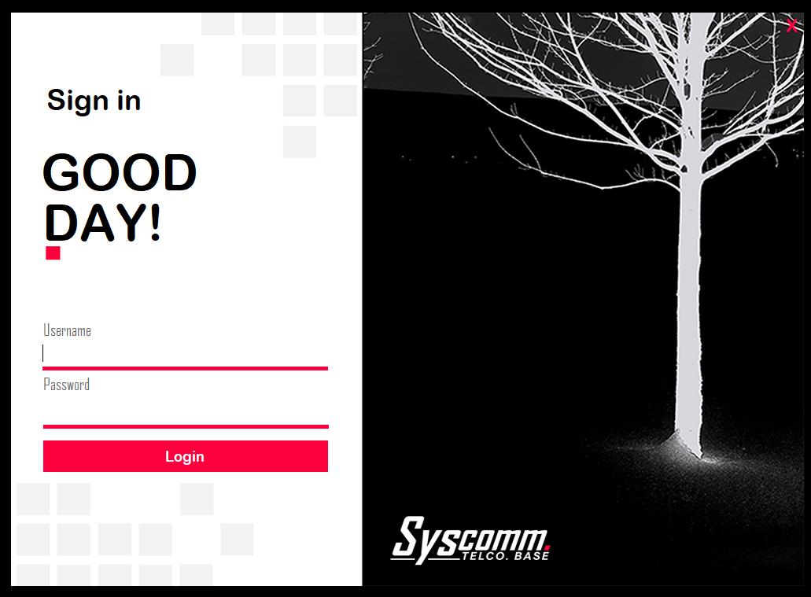

# Fligno Application - React JS / Firebase

## Welcome! 👋

Thanks for checking out this Desktop Application.

**This application Utilizes**

- Microsoft Visuals
- C++
- XAMPP
- MySQL (MariaDB)

## App Flow Design

The application starts off with the concept of Data Time logging system.
For company who would want to require their employee to strictly follow Work Time range.
Meant for WFH but can also be utilized in an office-based system.

Your users(Admin) shoule be able to:

- Create New Employees
- Delete Employees Data
- Updates Employees Data
- Show all Workers
- Check their Time data

Your users(Employee) should be able to:

- Login with their Assigned Company Authentication
- See their details regarding the company.
- Time in and time out which are unalterable to prevent fraud from employee.
